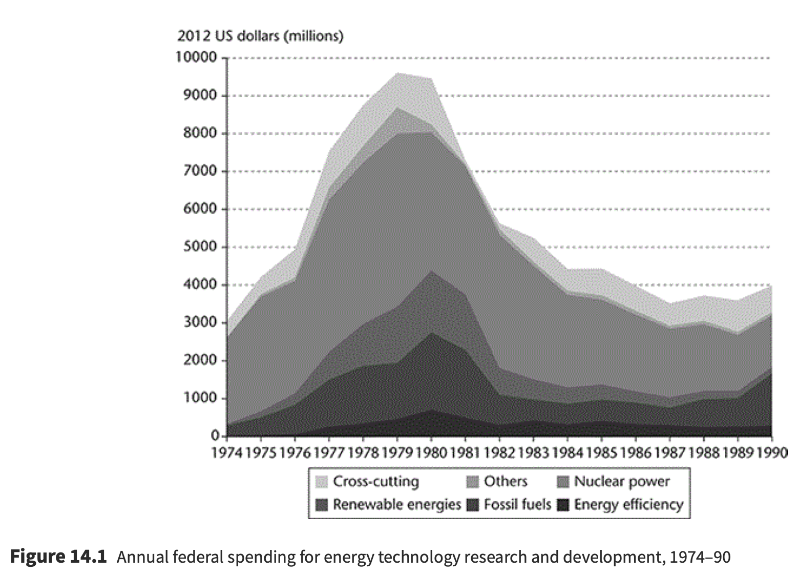

---

##### Download

+ [Full Paper](2018_uncertain.pdf)

---

##### Abstract

This chapter brings together arguments from economics, sociology, and political economy to show that innovation processes are characterized by a dilemma between the advantages of aligned expectations–including greater coordination and investment—and those of diversity, including superior openness to new technological possibilities. To illustrate the argument, the chapter discusses a historical case involving one of the largest coordinated peace-time attempts to hasten technological innovation in the history of capitalism, namely the US energy technology policies of the 1970s and 1980s. Close
examination of the commercialization of photovoltaics and synthetic fuel initiatives illustrates both sides of the dilemma between shared versus diverse expectations in innovation: coordination but possible premature lock-in on the one hand, and openness but possible stagnation on the other. The chapter shows that even the exploration and interpretation of new technologies may be as much a product of focused investment as of trial-and-error search.

---

##### Figure 1: Renewables R&D spending



---

##### Citation

Ergen, Timur, 2018. The Dilemma between Aligned Expectations and Diversity in Innovation: Evidence from Early Energy Technology Policies. In: Jens Beckert and Richard Bronk (eds.), Uncertain Futures: Imaginaries, Narratives, and Calculation in the Economy. Oxford, Oxford University Press, pp. 298–318.

```BibTeX
@INCOLLECTION{ergen2018aligned,
author = {Ergen, Timur},
year = {2018},
title ={The Dilemma between Aligned Expectations and Diversity in Innovation: Evidence from Early Energy Technology Policies},
booktitle = {Uncertain Futures: Imaginaries, Narratives, and Calculation in the Economy},
editor = {Beckert, Jens and Bronk, Richard},
publisher = {Oxford University Press},
location = {Oxford},
pages = {298–318},
url = {https://doi.org/10.1093/oso/9780198820802.001.0001}}
```

---

