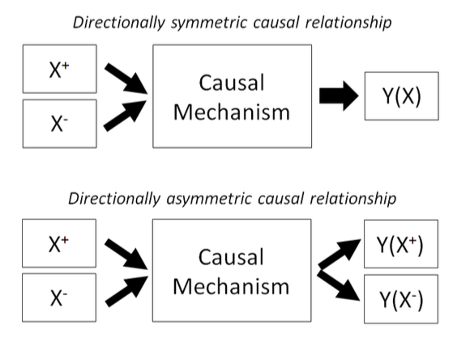

---

##### Download

+ [Full Paper](2019_asymmetry.pdf)

---

##### Abstract

Social scientists often treat causal relationships as inherently symmetric: if an increase in X leads to an increase in Y, a decline in X will lead to a corresponding decline in Y. This paper challenges this conventional approach and argues that many causal relationships are in fact asymmetric, because their underlying mechanisms work in asymmetric ways. While researchers are aware of this in principle, it is often not reflected in research practice. Therefore, we call on social scientists to pay more attention to the possibility of asymmetric relationships in their theories and their empirical research. They otherwise run the risk of accidentally rejecting sound theories or accepting faulty ones. We develop a typology of different mechanisms generating asymmetry, demonstrate their empirical relevance by replicating empirical studies of electoral dynamics, discuss strategies to deal with asymmetry, and show the relevance of asymmetry for social analysis and political reform.

---

##### Asymmetric relationships and causal mechanisms



---

##### Citation

Haffert, Lukas and Timur Ergen, 2019. The Symmetric Fallacy: The Dangers of Symmetric Reasoning in the Social Sciences. *CES Open Forum Series*.

```BibTeX
@ARTICLE{Ergen2019asymmetry,
  author = {Haffert, Lukas and Ergen, Timur},
  date = {2019},
  title = {The Symmetric Fallacy: The Dangers of Symmetric Reasoning in the Social Sciences},
  journaltitle = {CES Open Forum Series},
  url = {https://ces.fas.harvard.edu/publications/the-symmetric-fallacy-the-dangers-of-symmetric-reason-ing-in-the-social-sciences}
}

```

---

