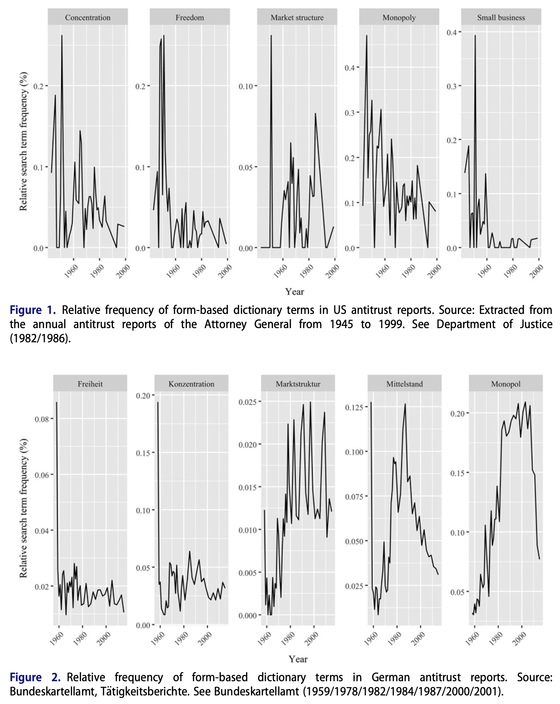

---

##### Download

+ [Full Paper](2019_ripe.pdf)

---

##### Abstract

This paper explains the different trajectories of German and American competition policy and its permissiveness toward economic concentration in the last few decades. While the German political economy had moved to a stronger antitrust regime after 1945 and stuck to it even after the economic governance shifts of the 1980s, the traditional antitrust champion, the United States, has shed considerable parts of its basic governance toolkit against anticompetitive conduct since the 1960s. Drawing on theories of institutional change driven by bureaucratic and professional elites, the paper claims that different pathways of professional ideas in competition policy can account for the cross-country differences. In the 1960s and early 1970s, movements to strengthen competition policy enforcement emerged in both countries. While German as well as American professionals reacted to the seemingly increasing encroachment of societal concerns into antitrust with economized notions of the policies’ goals, they did so in fundamentally different ways. Whereas US professionals proposed an effect-based approach in which consumer welfare and gains in efficiency may justify less competition, the more strongly law-based profession in Germany to a degree strengthened a form-based approach aiming at the preservation of competitive market structures. Such extrapolitical pathways of ideas, we argue, provide important guidelines for the implementation of competition policy by administrations and courts, whose decisions can have a far-reaching impact on industries and political economies as a whole.

---

##### Figure 1: Dictionary-based analysis of antitrust reports



---

##### Citation

Ergen, Timur & Sebastian Kohl, 2019. Varieties of Economization in Competition Policy: Institutional Change in German and American Antitrust, 1960–2000. *Review of International Political Economy* 26, 2, pp. 256–286.

```BibTeX
@ARTICLE{Ergen2019,
  author = {Ergen, Timur and Kohl, Sebastian},
  date = {2019},
  title = {Varieties of Economization in Competition Policy: Institutional Change in German and American Antitrust, 1960–2000},
  journaltitle = {Review of International Political Economy},
  volume = {26},
  number = {2},
  pages = {256–286},
  url = {https://doi.org/10.1080/09692290.2018.1563557}
}

```

---

