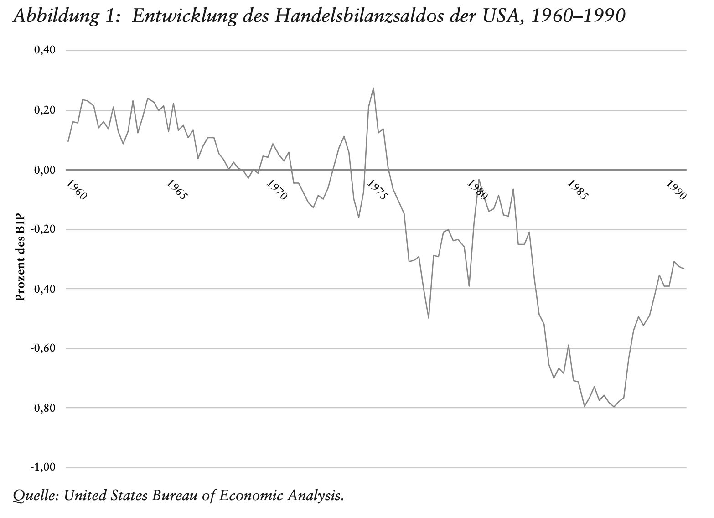

---

##### Download

+ [Full Paper](2019_leviathan.pdf)

---

##### Abstract

The paper demonstrates how the Reagan administrations deployed stories of national economic decline to raise popular support for neoliberal reform. Following radical tax reforms, empty promises of reindustrialization then pushed the administration into the arena of trade policy and protectionist measures against key trading partners. 

---

##### Figure 1: The Emergence of the 1980s' US Trade Deficit



---

##### Citation

Ergen, Timur, 2019. Wirtschaftliche Untergangsszenarien und neoliberale Reformen. *Leviathan* 47, 2, pp. 144–168.

```BibTeX
@ARTICLE{Ergen2019leviathan,
  author = {Ergen, Timur},
  date = {2019},
  title = {Wirtschaftliche Untergangsszenarien und neoliberale Reformen},
  journaltitle = {Leviathan},
  volume = {47},
  number = {2},
  langid = {de-DE},
  pages = {144–168},
  url = {https://doi.org/10.5771/0340-0425-2019-2-144}}

```

---

