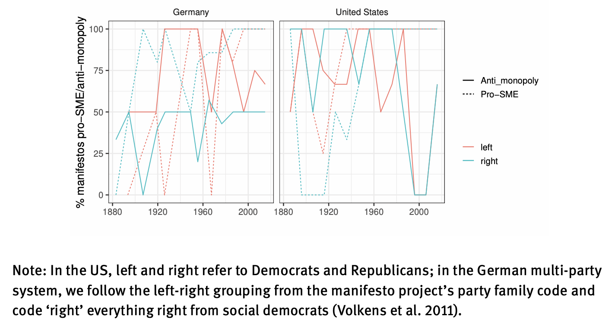

---

##### Download

+ [Full Paper](2021_mittelstand.pdf)

---

##### Abstract

Corporate concentration is currently being discussed as a core reason for the crisis of democratic capitalism. It is seen as a prime mover for wage stagnation and alienation, economic inequalities and discontent with democracy. A tacit coalition of progressive anti-monopoly critiques and small business promoters considers more deconcentrated corporate structures to be a panacea for the crisis of democratic capitalism, arguing that small firms in competition are better for employment, equality and democracy. This paper offers a brief outline of ideas of the anti-monopoly and small business ideal and critically evaluates whether a more deconcentrated economy may live up to these promises. While we agree that the plea for strengthened antitrust enforcement contains relevant and promising prospects for reform, our analysis concludes on a decidedly critical note. In particular, we caution against romanticized notions of the small capitalist firm. 

---

##### Decennial averages of anti-monopoly and pro-SME positions in party manifestos



---

##### Citation

Kohl, Sebastian & Timur Ergen, 2021. Is More Mittelstand the Answer? Firm Size and the Crisis of Democratic Capitalism. *Analyse & Kritik* 43, 1, pp. 41–70.

```BibTeX
@ARTICLE{Ergen2021mittelstand,
  author = {Ergen, Timur and Kohl, Sebastian},
  date = {2021},
  title = {Is More Mittelstand the Answer? Firm Size and the Crisis of Democratic Capitalism},
  journaltitle = {Analyse & Kritik},
  volume = {43},
  number = {1},
  pages = {41–70},
  url = {https://doi.org/10.1515/auk-2021-0004}}

```

---

