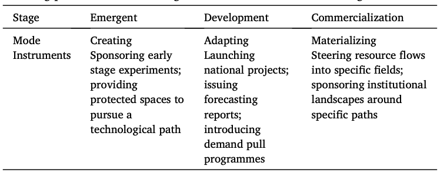

---

##### Download

+ [Full Paper](2021_shifting.pdf)

---

##### Abstract

This article builds on the literature on sociotechnical imaginaries and the sociology of expectations to engage in the discussion of how expectation alignment facilitates the development of novel technologies. While existing scholarship has elaborated on how expectations alignment is important to support technological development, it has not fully explored how the challenges of expectation alignment are translated into practices of expectation management and collective governance over the innovation process. Based on a range of archival sources, the article examines three historical episodes of photovoltaics development in locations that had spearheaded its development: the United States, Japan and Germany. Based on these historical episodes, the article suggests three core issues for the management of expectations in technological development: the creation, adaptation and materialization of shared imaginaries.

---

##### Evolving patterns of collective governance of sociotechnical imaginaries



---

##### Citation

Ergen, Timur and Maki Umemura, 2021. Shifting Patterns of Expectations Management in Innovation Policy: A Comparative Analysis of Solar Energy Policy in the United States, Japan and Germany. *Energy Research and Social Science* 79, 102177.

```BibTeX
@ARTICLE{Ergen2021mittelstand,
  author = {Ergen, Timur and Umemura, Maki},
  date = {2021},
  title = {Shifting Patterns of Expectations Management in Innovation Policy: A Comparative Analysis of Solar Energy Policy in the United States, Japan and Germany},
  journaltitle = {Energy Research and Social Science},
  volume = {79},
  pages = {102177},
  url = {https://doi.org/10.1016/j.erss.2021.102177}}

```

---

