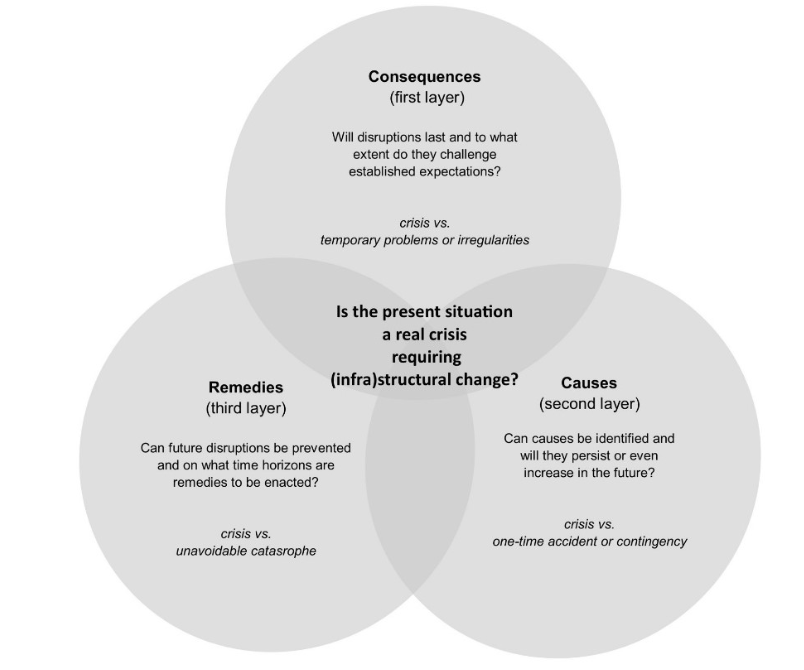

---

##### Download

+ [Full Paper](2022_contested.pdf)

---

##### Abstract

The oil crisis of 1973/74 is commonly seen as the advent of state-led attempts to restructure rich societies' energy infrastructures. Indeed, from a historical perspective, crises have repeatedly facilitated infrastructural transformations toward sustainability. But under what conditions can crises challenge existing orders and promote alternative infrastructures? Drawing on a historical vignette that reconstructs the public discourse emerging around the first oil crisis in the United States, this article proposes to reconsider the transformative potential of crises from a perspective focusing on the contested constitution of the future. We argue that the potential of crises to foster broader processes of infrastructural change is dependent on the capacity of actors to discursively challenge hopes and expectations inscribed in established infrastructures. As the example of the first oil crisis illustrates, crises are instances in which political actors engage in interpretative struggles to settle on whether disruptions present 'real' crises that require infrastructural transformation - or are mere accidents, errors, or irregularities that existent infrastructure can either withstand or requires only minor adaption as a result. In these discursive struggles, images of the future are contested on three layers: tangible experiences are linked to or detached from broader future consequences; potential causes are projected into the future or relegated to the past; and feasible future remedies are conceived or discarded. It is on these three layers of crisis discourse that the future is 'opened up,' and alternative infrastructures become conceivable.

---

##### Contested Futures: Three Layers of Crisis Discourse



---

##### Citation

Ergen, Timur & Lisa Suckert, 2022. Contested Futures: Reimagining Energy Infrastructures in the First Oil Crisis. *Historical Social Research* 47, 4, 242–266.


```BibTeX
@ARTICLE{Ergen2022contested,
  author = {Ergen, Timur and Suckert, Lisa},
  date = {2022},
  title = {Contested Futures: Reimagining Energy Infrastructures in the First Oil Crisis},
  journaltitle = {Historical Social Research},
  volume = {47},
  number = {4},
  pages = {242–266},
  url = {https://doi.org/10.12759/hsr.47.2022.46}}

```

---

