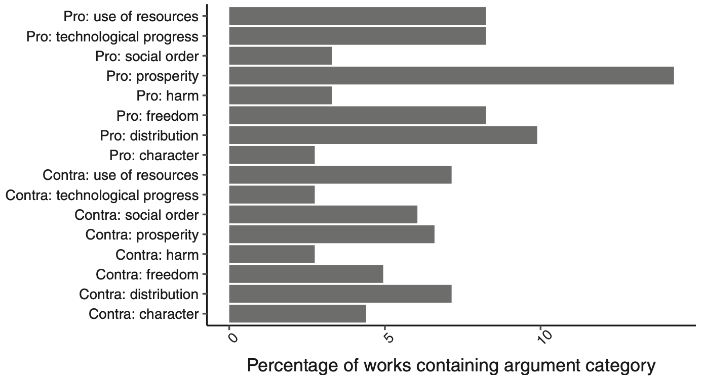
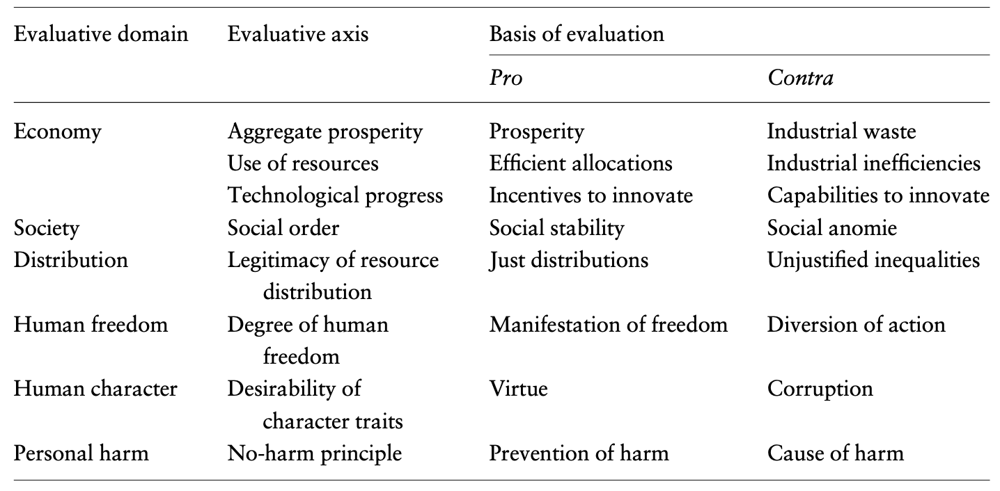

---

##### Download

+ [Full Paper](2022_rival.pdf)

---

##### Abstract

Competition is a constitutive feature of capitalist societies. Social conflicts over the introduction, abolition and regulation of market organization are saturated with implicit moral arguments concerning the desirability of competition. Yet, unlike private property, exchange relations and social inequalities, economic competition has rarely been the explicit core of moral debates over capitalism. Drawing on a broad variety of social science literature, this article reconstructs, maps and systematizes ethical arguments about economic competition in capitalist societies. We discuss six contradictory rival views of economic competition and illustrate their influence by providing historical examples of the respective views in action in political-economic debates. This article serves as a mapping groundwork for reviving the systematic ethical debate on economic competition. In addition, our map of rival views lends itself to use as a structuring tool in empirical research on the moral economy and ideational embeddedness of capitalist societies, markets and firms. 

---

##### Relative frequency of arguments pro and contra competition



---

#####  Rival views summarized



---

##### Citation

Ergen, Timur & Sebastian Kohl, 2022. Rival views of economic competition. *Socio-economic Review* 20, 3, pp. 937–965.

```BibTeX
@ARTICLE{Ergen2021rivalviews,
  author = {Ergen, Timur and Kohl, Sebastian},
  date = {2021},
  title = {Rival views of economic competition},
  journaltitle = {Socio-economic Review},
  volume = {20},
  number = {3},
  pages = {937–965},
  url = {https://doi.org/10.1093/ser/mwaa041}}

```

---

