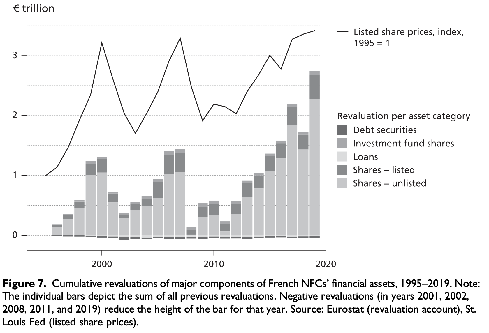

---

##### Download

+ [Full Paper](2022_firmfoundations.pdf)

---

##### Abstract

The discipline of comparative political economy (CPE) relies heavily on aggregate, country-level economic indicators. However, the practices of multinational corporations have increasingly undermined this approach to measurement. The problem of indicator drift is well documented by a growing critical literature and calls for systematic methodological attention in CPE. We present the case for a rocky but ultimately rewarding middle road between indicator fatalism and indicator faith. We illustrate our argument by examining two important cases—Sweden’s recent export success and the financialization of non-financial corporations in France. A careful parsing of the data suggests corrections to common characterizations of the two cases. Swedish exports have been reshaped by intragroup trade among foreign subsidiaries of domestic corporations. The growth of financial assets held by French firms is attributable to the growth of foreign direct investment and to cumulative revaluation effects, while what remains of financialization is concentrated among the very largest firms. Based on these findings, we propose a methodological routine that parses data by zooming in on the qualitative specifics of countries, sectors, and firms, while using all available options for disaggregation.

---

##### Cumulative revaluations of major components of French NFCs’ financial assets, 1995–2019



---

##### Citation

Ergen, Timur, Benjamin Braun & Sebastian Kohl. 2022. Firm foundations: The statistical footprint of multinational
corporations as a problem for political economy.*Competition & Change* 27, 1, pp. 44–73.

```BibTeX
@ARTICLE{Ergen2022firmfoundations,
  author = {Ergen, Timur and Braun, Benjamin and Kohl, Sebastian},
  date = {2022},
  title = {Firm foundations: The statistical footprint of multinational corporations as a problem for political economy},
  journaltitle = {Competition & Change},
  volume = {27},
  number = {1},
  pages = {44–73},
  url = {https://doi.org/10.1177/10245294221093704}}

```

---

