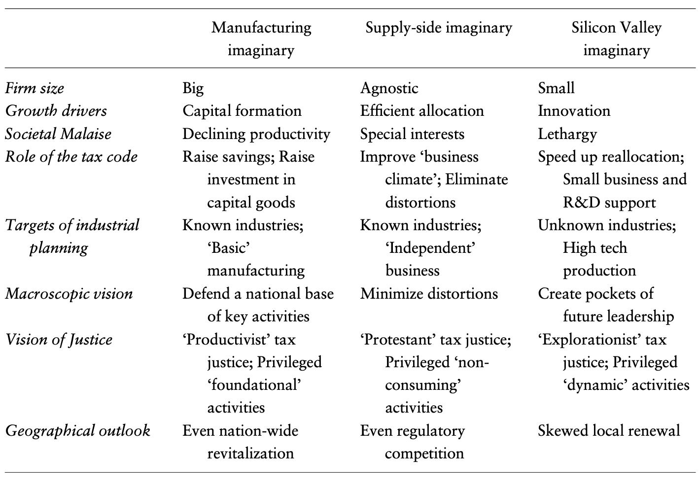

---

##### Download

+ [Full Paper](2023_silicon.pdf)

---

##### Abstract

How do policy paradigms change? This article demonstrates that changing social imaginaries about economic growth enabled paradigmatic changes in USA corporate tax policy in the 1980s. Based on archival sources, it reconstructs how policy makers switched from focused support for capital-intensive smoke-stack industries towards support for emerging high tech-sectors between two major tax-bills in 1981 and 1986. This switch was made possible by the emergence of what we call the Silicon Valley imaginary—the idea that sound economic policies stimulate the reallocation of society’s resources towards new economic fields. The emergence of this social imaginary resulted from political realignments and changing notions of economic growth and justice. The search for sources of future economic growth and societal coalitions led policy-makers to appropriate ideas about the promises of new industries.

---

##### Imaginaries of economic growth in conflicts over corporate taxation



---

##### Citation

Ergen, Timur & Inga Rademacher 2023. The Silicon Valley imaginary: US corporate tax reform in the 1980s. *Socio-economic Review* 21, 2, pp. 935–957.

```BibTeX
@ARTICLE{Ergen2023silicon,
  author = {Ergen, Timur and Rademacher, Inga},
  date = {2023},
  title = {The Silicon Valley imaginary: US corporate tax reform in the 1980s},
  journaltitle = {Socio-economic Review},
  volume = {21},
  number = {2},
  pages = {935–957},
  url = {https://doi.org/10.1093/ser/mwab051}}

```

---

