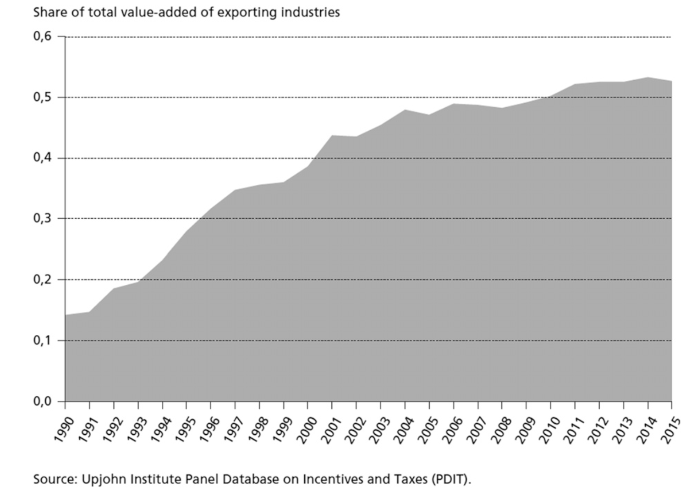

---

##### Download

+ [Full Paper](2023_nostrings.pdf)

---

##### Abstract

This paper contributes to Comparative Political Economy (CPE) by developing an analytical concept of corporate welfare. Corporate welfare—the transfer of public funds and benefits to corporate actors with weak or no conditionality—is a prominent form of state-business relations that CPE scholarship regularly overlooks and misinterprets. Such transfers should be understood as a structural privilege of business in a globalized post-Fordist capitalism, and an increasingly common strategy through which states attempt to steward national economic dynamism within a highly constrained range of policy options. However, without a well-developed concept of corporate welfare—premised upon the key criterion of conditionality—studies that identify a 'return' of the state in industrial planning misrepresent these transfers to business as a reassertion of state influence and control, rather than a reflection of state weakness and subordination. The paper provides the analytical building blocks to properly conceptualize transfers to business, works out the core challenges for empirical research, and provides empirical illustrations of this burgeoning phenomenon from the fields of unconventional monetary policy, privatization, and urban political economy.

---

##### Incentives for exporting industries across the United States, 1990–2015



---

##### Citation

Bulfone, Fabio, Timur Ergen & Manolis Kalaitzake, 2023. No strings attached: Corporate welfare, state intervention, and the issue of conditionality. *Competition & Change* 27, 2, pp. 253–276.

```BibTeX
@ARTICLE{Bulfoneetal2023nostrings,
  author = {Ergen, Timur and Kohl, Sebastian},
  date = {2023},
  title = {No strings attached: Corporate welfare, state intervention, and the issue of conditionality},
  journaltitle = {Competition & Change},
  volume = {27},
  number = {2},
  pages = {253–276},
  url = {https://doi.org/10.1177/10245294221101145}}

```

---

