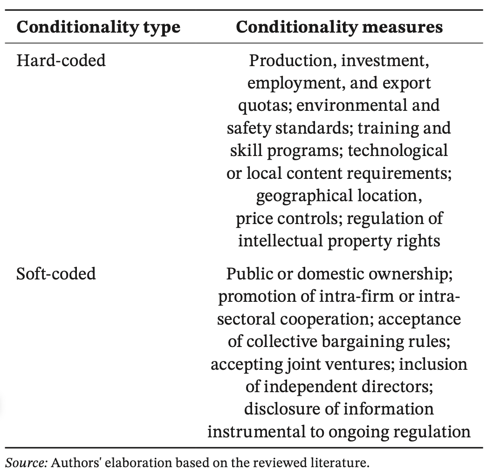
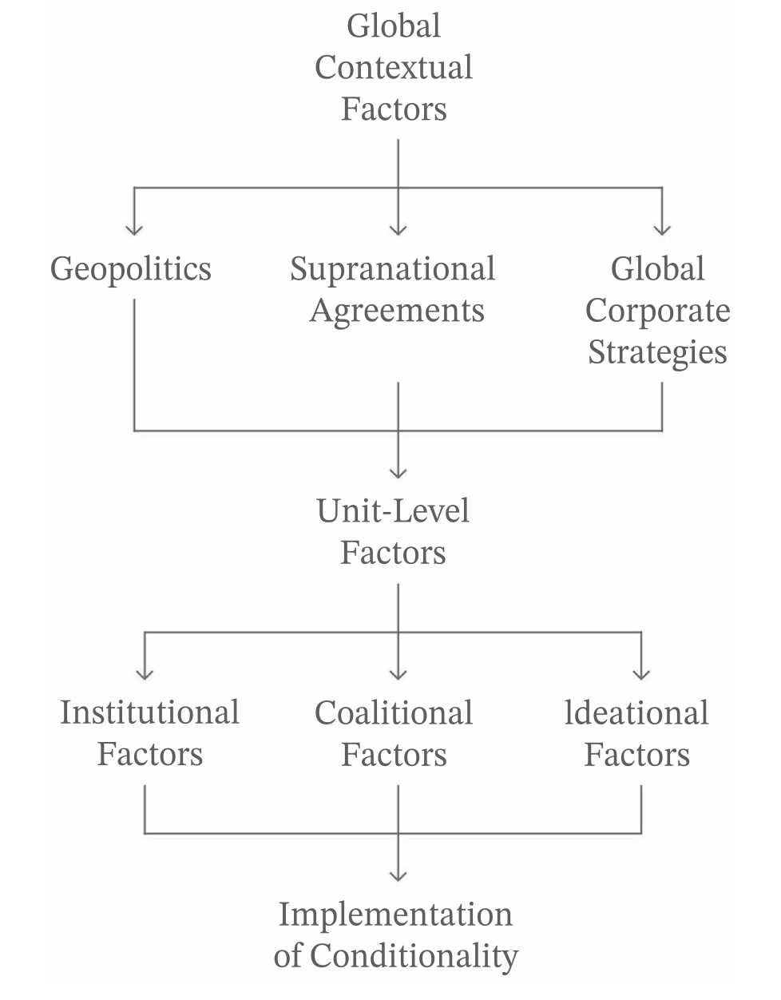

---

##### Download

+ [Full Paper](2025_conditionality.pdf)

---

##### Abstract

Conditionality was a central concern in the development literature of the 1990s. With the significant expansion of targeted public support to private firms since the Great Financial Crisis, the issue of conditionality has once again become a focal point in industrial policy debates. Despite the growing interest in the concept, the existing literature lacks a systematic conceptualization of conditionality within the context of industrial policy and does not outline the political factors that enable state actors to introduce it. This article addresses this gap by critically reviewing the existing literature and providing a systematic political economy of conditionality. We offer an overview of the literature on conditionality, examining different industries, historical periods, and national contexts. In doing so, we make three key contributions to the debate on industrial policy and regulatory instruments more broadly. First, we distinguish between two broad approaches to encoding conditionality in industrial policy: hard-coding and soft-coding. Next, we map the coalitional, institutional, ideational, and global contextual factors that facilitate conditionality. Finally, we present two vignettes of recent industrial policy initiatives in the European Union and the United States as illustrative cases. This conceptual exercise, intended to lay the foundation for future causal research on conditionality, demonstrates that the presence of conditionality is not merely a technical matter of political design but is instead shaped by configurations of political economy factors.

---

##### Varieties of conditionality



---

##### Implementation of conditionality



---

##### Citation

Bulfone, Fabio, Timur Ergen & Erez Maggor, 2025. Regulating via Conditionality: The Instruments of the New Industrial Policy. *Regulation & Governance* Online First(https://doi.org/10.1111/rego.70050).

```BibTeX
@ARTICLE{bulfoneetal2025conditionality,
  author = {Bulfone, Fabio and Ergen, Timur and Maggor, Erez},
  date = {2025},
  title = {Regulating via Conditionality: The Instruments of the New Industrial Policy},
  journaltitle = {Regulation & Governance},
  volume = {Online First},
  url = {https://doi.org/10.1111/rego.70050}}

```

---

