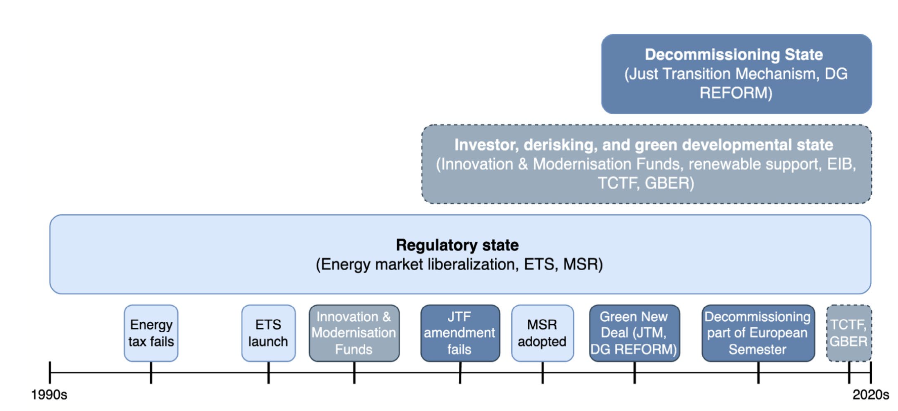

---

##### Download

+ [Full Paper](2025_losers.pdf)

---

##### Abstract

Decarbonization forces societies to cope with the restructuring and outright unwinding of assets, firms, workers, industries, and regions. We argue that this problem has created legitimacy for industrial policies managing the reallocation of resources. We illustrate this dynamic by documenting incremental state-building in the European Union, an administration institutionally tilted toward regulatory statehood and the making of the Single Market in energy since the 1990s. European greening policies, we argue, have incrementally lessened the primacy of regulatory tools and have introduced a plethora of instruments to accelerate green restructuring and carbon unwinding. Best understood as a process of multi-sited institutional layering, the European Union increasingly appears to complement financial and regulatory instruments to effect green energy transitions with the management of decline in targeted regions and sectors, based on targeted funds and targeted transition planning.

---

##### Institutional layering in EU climate policy, 1990–2020s



---

##### Citation

Ergen, Timur & Luuk Schmitz, 2025. Picking Losers: Climate Change and Managed Decline in the European Union. *Regulation & Governance* 19, 2, 383–398.

```BibTeX
@ARTICLE{Ergen2025losers,
  author = {Ergen, Timur and Schmitz, Luuk},
  date = {2025},
  title = {Picking Losers: Climate Change and Managed Decline in the European Union},
  journaltitle = {Regulation & Governance},
  volume = {19},
  number = {2},
  pages = {383–398},
  url = {https://doi.org/10.1111/rego.70004}}

```

---

